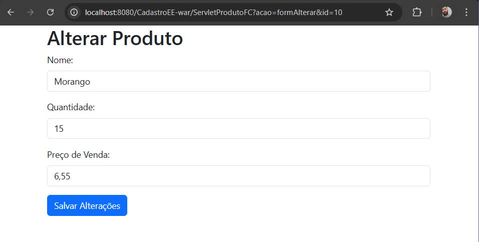
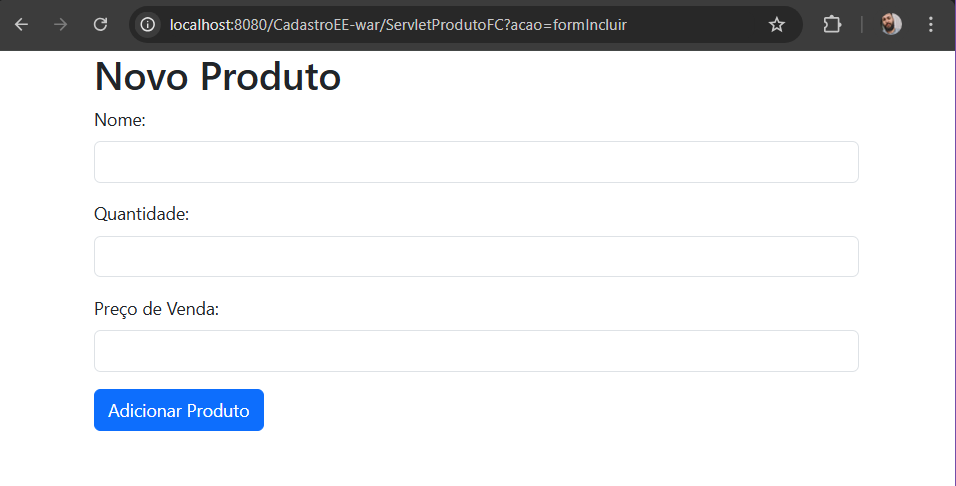

# Faculdade Estácio
## Curso Desenvolvimento Full Stack
## Mundo 3 - Nível 4
## Pedro Wilson Araújo Avilar

### Sistema cadastral de produtos com interface Web

Utilizando as ferramentas Microsoft SQL Server Management Studio (SSMS), Java Development Kit (JDK), NetBeans e o framework Bootstrap para desenvolver um aplicativo em Java, sendo um sistema cadastral de produtos, com interface web, usando Java Persistence API (JPA) para a persistência em banco de dados, Java Enterprise Edition (JEE) para as regras de negócio, Servlets e JSPs.

Página de listagem de produtos

Página para alterar um produto

Página para adicionar um produto
